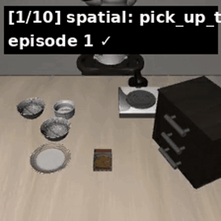
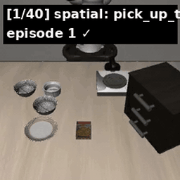
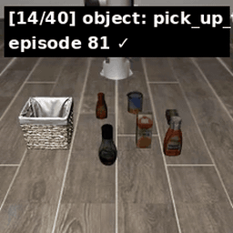
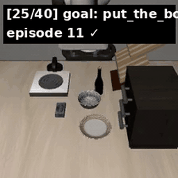
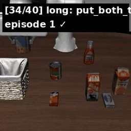

<div align="center">

# vla-lab

**Independent VLA Reproduction & Research Notes**

*Personal project by Liu Zhi (刘志) — transitioning from autonomous-driving motion planning into embodied AI / Vision-Language-Action models.*

[]()
[]()
[]()

<br/>

<a href="https://github.com/lz-googlefycy/vla-lab/releases/download/v0.1-demos/openvla_libero_4suite_demo.mp4" title="Click to play full 4-suite demo MP4 (5 MB, 40 clips, ~4 min)">

</a>

<sub>▶ <b>Click the animation</b> to play the full <b>4-suite demo MP4</b> (40 clips, ~4 min, 5 MB) — hosted on <a href="https://github.com/lz-googlefycy/vla-lab/releases/tag/v0.1-demos">Release v0.1-demos</a>.</sub>

</div>

---

## ⭐ TL;DR

- 🚧 **Active main line**: Cross-Base Preference Alignment for VLA Models — **DPO + GRPO across OpenVLA / Spirit / π0.5 on LIBERO 4-suite**. Workshop paper target. See [`code/post_training/`](code/post_training/) + [`docs/upstream_contributions.md`](docs/upstream_contributions.md).
- ✅ Reproduced **OpenVLA-7B on LIBERO 4-suite** (400 rollouts): **Spatial 78% / Object 60% / Goal 77% / Long 53%** vs paper 76.5 avg → see the [focused repo](https://github.com/lz-googlefycy/openvla-libero)
- ✅ **Spirit v1.5 (千寻智能, RoboChallenge #1) smoke test passes on RTX 3090 24 GB: 6.1 Hz steady-state, bf16, 10 GB VRAM.** Code + adapter open-sourced. Full engineering notes: [`docs/troubleshooting.md`](docs/troubleshooting.md) + [`docs/insights.md`](docs/insights.md)
- ✅ Published critical analyses of **7 major VLA papers** (RT-1, RT-2, Octo, OpenVLA, π0, π0.5, π*0.6) — *skeptical-by-default review*
- ✅ **Phase B-1 LoRA pipeline working**: Spirit v1.5 LoRA on synthetic data, loss 1.385 → 0.082 in 300 steps (94% reduction) on a single datacenter GPU. See [`assets/spirit/blog2_figures/lora_smoke_loss.png`](assets/spirit/blog2_figures/lora_smoke_loss.png).
- ✅ **Phase 1 OpenVLA-DPO end-to-end**: Real OpenVLA-7B + LoRA + DPO pipeline runs on RTX 3090 24 GB. Loss starts at exact ln(2), accuracy → 1.0 in 6 steps, margin to +28 in 30 steps. See [`assets/post_training_v0/openvla_dpo_smoke_30step.jsonl`](assets/post_training_v0/openvla_dpo_smoke_30step.jsonl).

---

## 🎬 LIBERO 4-suite at a glance

<div align="center">

<table>
<tr>
<td align="center">
<b>Spatial</b> · 78% SR<br/>
<i>same object, different positions</i><br/>
<a href="https://github.com/lz-googlefycy/vla-lab/releases/download/v0.1-demos/openvla_libero_spatial_demo.mp4" title="Click to play full Spatial demo MP4"></a>
</td>
<td align="center">
<b>Object</b> · 60% SR<br/>
<i>same layout, different objects</i><br/>
<a href="https://github.com/lz-googlefycy/vla-lab/releases/download/v0.1-demos/openvla_libero_4suite_demo.mp4" title="Click to play full 4-suite demo MP4"></a>
</td>
</tr>
<tr>
<td align="center">
<b>Goal</b> · 77% SR<br/>
<i>different task goals</i><br/>
<a href="https://github.com/lz-googlefycy/vla-lab/releases/download/v0.1-demos/openvla_libero_4suite_demo.mp4" title="Click to play full 4-suite demo MP4"></a>
</td>
<td align="center">
<b>Long (10)</b> · 53% SR<br/>
<i>long-horizon multi-step tasks</i><br/>
<a href="https://github.com/lz-googlefycy/vla-lab/releases/download/v0.1-demos/openvla_libero_4suite_demo.mp4" title="Click to play full 4-suite demo MP4"></a>
</td>
</tr>
</table>

<sub>GIFs are 20 s previews that autoplay. <b>Click any preview</b> to play the corresponding MP4 with pause / seek / fullscreen controls. Full <a href="https://github.com/lz-googlefycy/vla-lab/releases/download/v0.1-demos/openvla_libero_4suite_demo.mp4">4-suite MP4 (40 clips, 5 MB)</a> covers all 4 suites. Reproduction scripts: <a href="https://github.com/lz-googlefycy/openvla-libero">openvla-libero</a>.</sub>

</div>

---

## 🎯 LIBERO Reproduction Results

Using **official OpenVLA finetuned checkpoints** from HuggingFace, 10 trials per task × 10 tasks = 100 rollouts per suite, bf16 + flash-attn-2 on a datacenter GPU server card.

| Suite | Paper SR | **Ours SR** | Δ | Status |
|:---|---:|---:|---:|:---:|
| Spatial | 84.7 ± 0.9 | **78.0%** | -6.7% | 🟢 within 10-trial noise |
| Object | 88.4 ± 0.8 | **60.0%** | -28.4% | 🟡 large gap, under investigation |
| Goal | 79.2 ± 1.0 | **77.0%** | -2.2% | 🟢 clean reproduction |
| Long (10) | 53.7 ± 1.3 | **53.0%** | -0.7% | 🟢 near-perfect reproduction |
| **Average** | **76.5** | **67.0%** | -9.5% | |

> **Long-task reproduction (53.0% vs 53.7%) is the headline** — OpenVLA's hardest suite, reproduced almost exactly.

**Demo videos**: [`assets/demos/`](./assets/demos/) (one clip per task, 4 suites × 10 tasks = 40 clips)

**How to reproduce**: [`docs/results_libero_official_ckpt.md`](./docs/results_libero_official_ckpt.md)

---

## 📚 VLA Paper Critical Reviews

I applied a rigorous `paper_analysis` SOP (Phase 1–5, skeptical-by-default) to every major VLA paper. Full Chinese reports in [`docs/`](./docs/):

| Paper | Year | Score | Key Finding |
|:---|---:|:---:|:---|
| [RT-1](./docs/) | 2022 | 6/10 | Engineering existence proof, not a new method |
| [RT-2](./docs/) | 2023 | 5/10 | Paradigm-opening, but "emergent" is over-marketed |
| [Octo](./docs/) | 2024 | 7/10 | Clean open baseline (not strictly VLA) |
| [OpenVLA](./docs/) | 2024 | 8/10 | Current open-source VLA standard |
| [π0](./docs/pi_series_analysis.md) | 2024 | — | Flow matching = packaging of Transfusion+DP+ACT |
| [π0.5](./docs/pi_series_analysis.md) | 2025 | — | "Open-world" is 3 similar-distribution homes |
| [π*0.6](./docs/pi_series_analysis.md) | 2025 | — | RECAP = clever advantage-conditioning trick |

Key cross-paper insight: **all ablations tell the same story — pre-training + data multiplicity contribute far more than architecture novelty.**

---

## 📂 Repository Structure

```
vla-lab/
├── README.md                     # this file
├── docs/                         # analyses, deployment notes, results
│   ├── env_setup.md             # image + hardware + file-system setup
│   ├── results_libero_official_ckpt.md    # 4-suite numbers + per-task
│   ├── spirit_analysis.md       # Spirit v1.5 repo + reproduction plan
│   ├── spirit_xlerobot_integration.md
│   ├── robochallenge_analysis.md
│   ├── pi_series_analysis.md    # π0 / π0.5 / π*0.6 critical review
│   ├── insights.md              # deeper observations across the project
│   ├── troubleshooting.md       # bugs and workarounds (deployment notes)
│   └── experiment_log.md        # daily progress records
├── docker/                       # Dockerfile (openvla-v1.0-cu118-py310)
├── code/
│   ├── scripts/                  # run_libero_{lora,eval,eval_all}.sh, sync_official_ckpts.sh
│   ├── tools/                    # smoke_test.py, build_demo_video.py, check_pipeline_status.sh
│   └── lora_moe/                 # skill-router skeleton (deprioritized)
├── assets/
│   └── demos/                    # 4 LIBERO demo MP4s (1–5 MB each)
└── notebooks/ tests/             # placeholders
```

---

## 🚀 Quick Start

### Prerequisites

- NVIDIA GPU ≥ 24 GB (RTX 3090 works for 4-bit inference; datacenter server card / A100 80GB for full-bf16)
- Docker + nvidia-container-runtime
- \~30 GB for model + \~10 GB for LIBERO RLDS dataset

### 1. Build or pull the image

```bash
# Build locally
cd docker
docker build -t openvla-v1.0-cu118-py310 .

# Or pull (TODO: mirror to public Docker Hub / HF)
# docker pull <public-registry>/openvla-v1.0-cu118-py310
```

Image inherits from a torch 2.2.0 + cu118 + py3.10 base and layers OpenVLA + LIBERO + flash-attn on top. See [`docs/env_setup.md`](./docs/env_setup.md) for exact package versions and known issues.

### 2. Download model + dataset

```bash
# OpenVLA-7B base (~15 GB)
HF_ENDPOINT=https://hf-mirror.com huggingface-cli download openvla/openvla-7b \
  --local-dir <path>/models/openvla-7b

# LIBERO RLDS (10 GB, needed only for training)
HF_ENDPOINT=https://hf-mirror.com huggingface-cli download \
  --repo-type dataset openvla/modified_libero_rlds \
  --local-dir <path>/datasets/modified_libero_rlds

# For eval only: 4 finetuned ckpts (~15 GB each, only download what you need)
for s in spatial object goal 10; do
  huggingface-cli download openvla/openvla-7b-finetuned-libero-$s \
    --local-dir <path>/models/openvla-7b-finetuned-libero-$s
done
```

### 3. Quick sanity check

```bash
docker run --rm --gpus all \
  -v <path>/models:/workspace/models \
  openvla-v1.0-cu118-py310 \
  python /workspace/openvla/../smoke_test.py
# Expected: 4-bit load 4.4 GB GPU, predict_action outputs (7,) float64 at ~3 Hz
```

### 4. Reproduce a LIBERO suite

```bash
# Single suite (10 trials/task × 10 tasks = 100 rollouts, ~1.5 h on a datacenter server card)
bash code/scripts/run_libero_eval.sh spatial \
  /workspace/models/openvla-7b-finetuned-libero-spatial 10

# All 4 suites with auto-summary (~6 h)
bash code/scripts/run_libero_eval_all.sh 10
```

The script auto-patches HuggingFace `auto_map` references to work offline (see [`docs/env_setup.md#known-gotchas`](./docs/env_setup.md)).

### 5. Build demo video

```bash
python code/tools/build_demo_video.py \
  --eval_dirs <path>/output/EVAL-*-libero_spatial \
              <path>/output/EVAL-*-libero_object \
              <path>/output/EVAL-*-libero_goal \
              <path>/output/EVAL-*-libero_10 \
  --out 4suite_demo.mp4 --per_task 1
```

---

## 🗺️ Roadmap

| Phase | Focus | Status |
|:---:|:---|:---|
| 0 | Infrastructure (image, data, dev environment) | ✅ done |
| 1 | LIBERO reproduction on official ckpts | ✅ done |
| 2 | Spirit v1.5 on XLeRobot (SO-100) | 🔜 active |
| 3 | LoRA fine-tune + cross-embodiment adaptation | planned |
| 4 | Real-robot demo + horizontal compare across open VLAs | planned |

---

## 🧭 Philosophy

1. **Skeptical-by-default paper reading.** Every ablation is audited, every "emergent" claim is challenged. The field over-markets.
2. **Reproducibility first.** If I can't run it end-to-end on public data + a single commodity GPU, the contribution value is discounted.
3. **Open everything.** Code, docs, eval logs, demo videos, mistakes. The field needs more honest post-mortems, not more hype posts.
4. **No institutional affiliation**, no hype vocabulary. Just experiments.

---

## 🤝 Community

- Found a bug or reproduction mismatch? Open an issue.
- Want to collaborate on XLeRobot / SO-100 / LeRobot? Ping me.
- Job-hunting in embodied AI? Let's compare notes.

**Contact**: open an issue, or email `liuzhi7 (Independent)` (see Git commit history).

---

## 📜 License

Code: MIT.
Written content (docs / blog drafts): CC BY 4.0.

---

## 🙏 Acknowledgments

- [Stanford + Berkeley + TRI OpenVLA team](https://openvla.github.io/) — for the only truly-open 7B VLA
- [Physical Intelligence](https://physicalintelligence.company/) — for `openpi` source that teaches flow-matching on action chunks
- [Spirit AI](https://www.spirit-ai.com/) — for open-sourcing `spirit-v1.5` and their RoboChallenge wrapper code
- [HuggingFace LeRobot team](https://github.com/huggingface/lerobot) — for XLeRobot + SO-100 open hardware stack
- [LIBERO team](https://libero-project.github.io/) — for the benchmark
