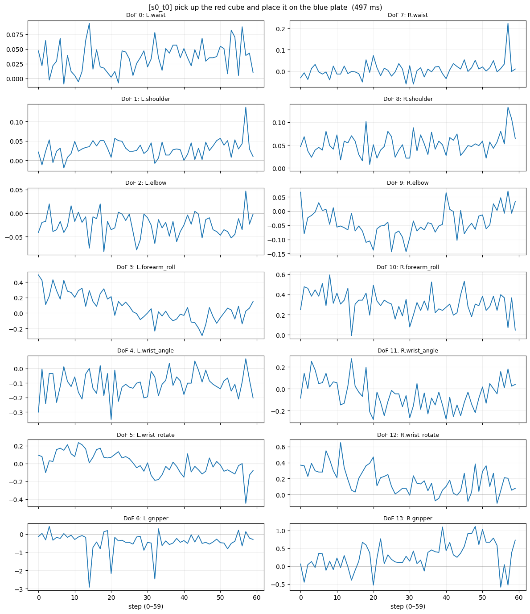
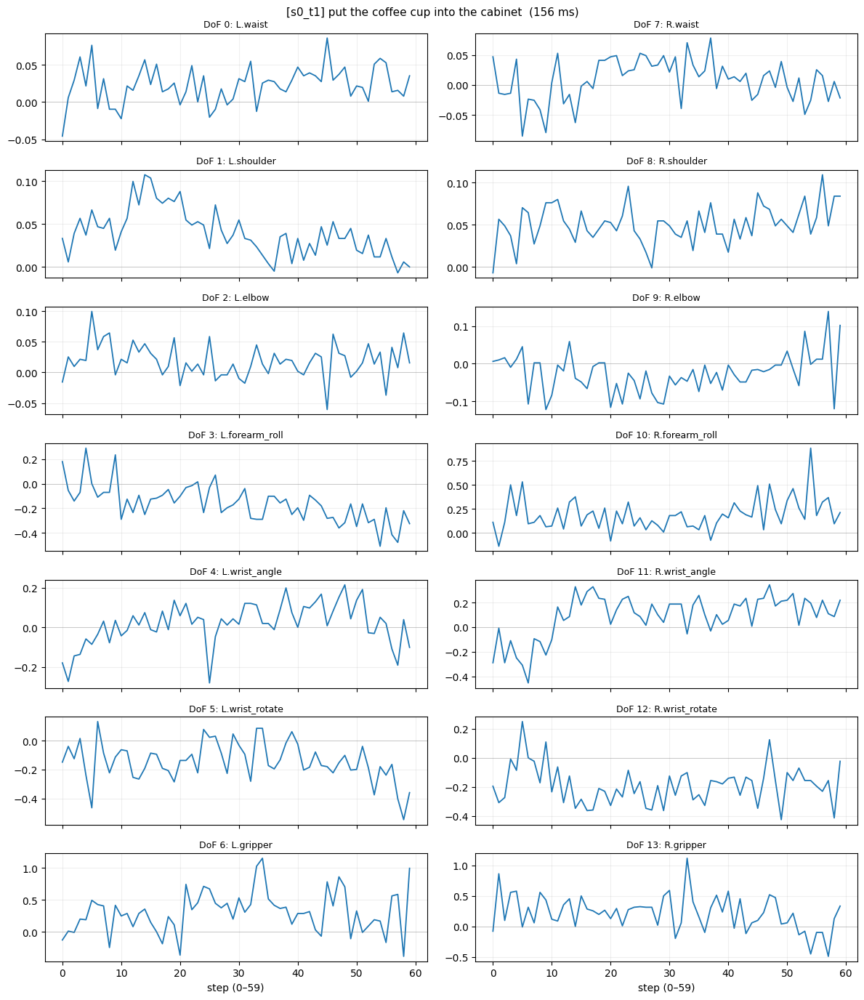
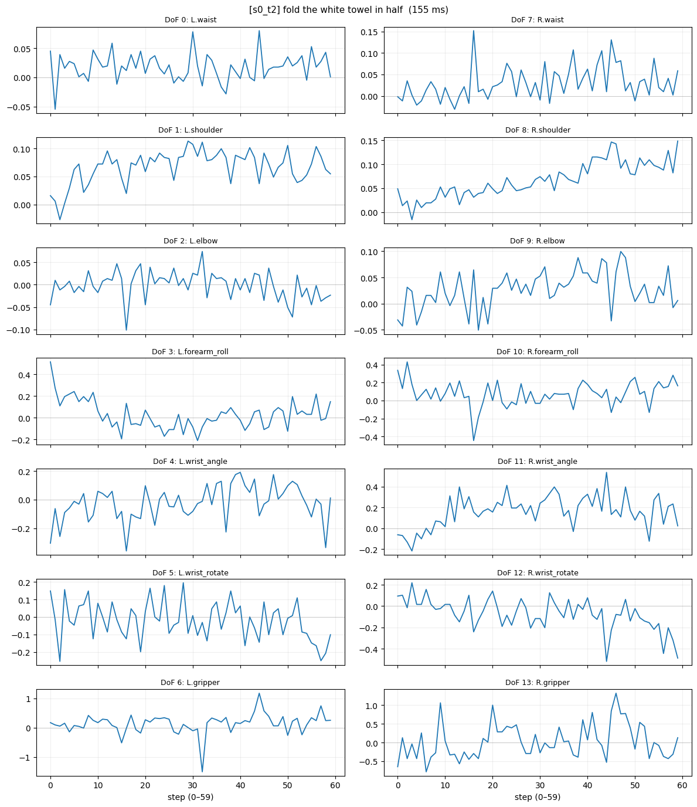
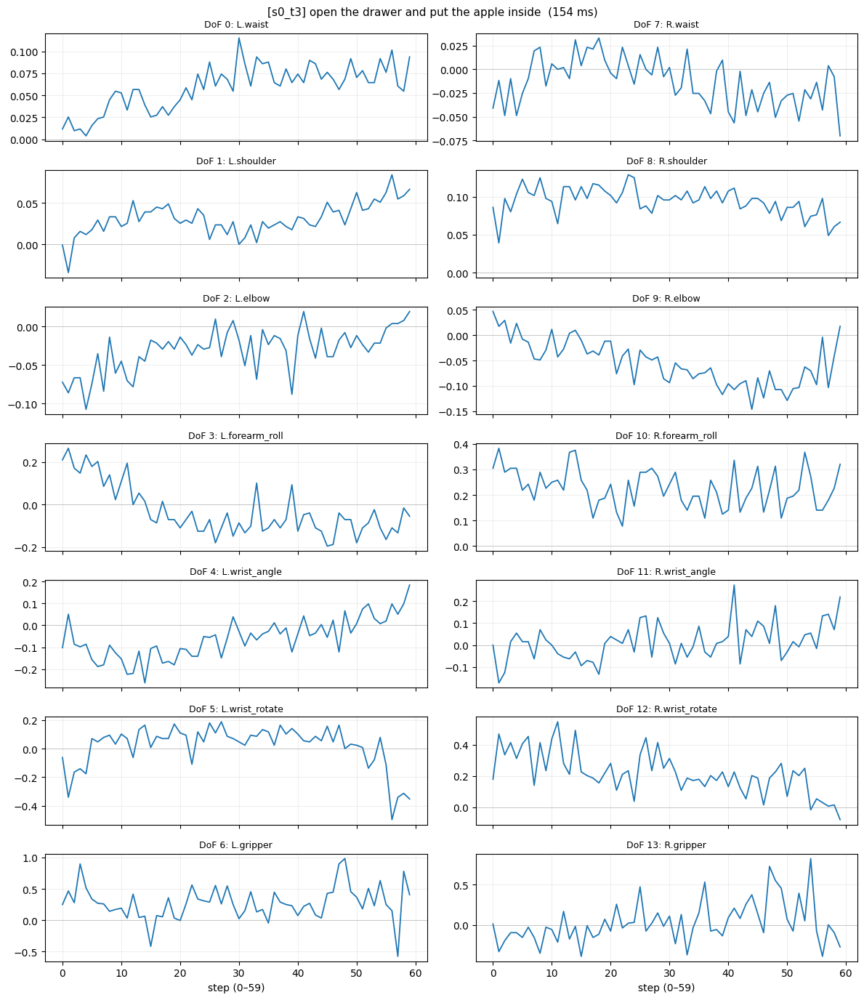
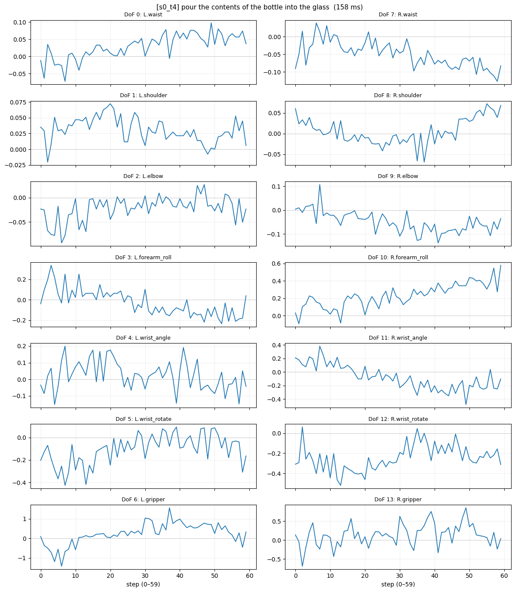

# Phase A — Spirit v1.5 on LIBERO scenes (zero-shot)

Feeding Spirit the LIBERO agentview image + language instruction, observing
what 14-DoF ALOHA-style action chunk it predicts. Spirit was NOT trained
on LIBERO — this is cross-embodiment, zero-shot.

Adapter: `tile_cam_high=True` (copies agentview to both wrist cam slots).

| tag | instruction | inf (ms) | chunk min | chunk max | input | chunk |
|---|---|---:|---:|---:|---|---|
| s0_t0 | pick up the red cube and place it on the blue plate | 497 | -2.92 | 1.11 |  |  |
| s0_t1 | put the coffee cup into the cabinet | 156 | -0.55 | 1.15 |  |  |
| s0_t2 | fold the white towel in half | 155 | -1.50 | 1.32 |  |  |
| s0_t3 | open the drawer and put the apple inside | 154 | -0.58 | 0.98 |  |  |
| s0_t4 | pour the contents of the bottle into the glass | 158 | -1.42 | 1.56 |  |  |
